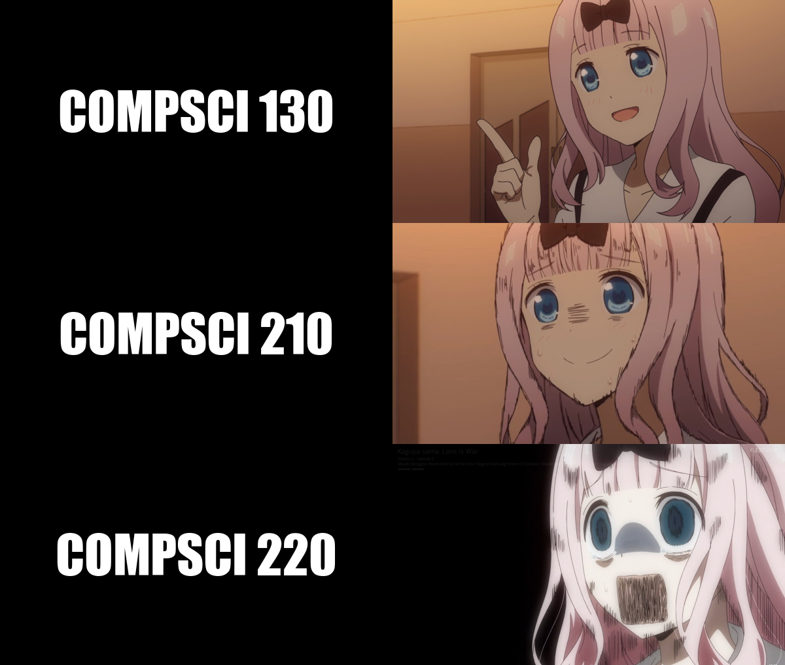

## Life of being in CS



As you can see the various ***FUN*** stages in doing CS

Here's the code:

```r
library(magick)

ok_chika <- image_read("https://i.redd.it/lw2u7nmb65c31.png") %>%
  image_scale(600)

stress_chika <- image_read("https://i.kym-cdn.com/entries/icons/mobile/000/029/857/Shirogane_learns_Volleyball_2-3_screenshot.jpg") %>%
  image_scale(600)

lost_it_chika <- image_read("https://pbs.twimg.com/media/EXtAMqQVAAIZBeF?format=jpg&name=large") %>%
  image_scale(600)

compsci130 <- image_blank(width = 600, 
                          height = 341, 
                          color = "#000000") %>%
  image_annotate(text = "COMPSCI 130",
                 color = "#FFFFFF",
                 size = 80,
                 font = "Impact",
                 gravity = "center")

compsci210 <- image_blank(width = 600, 
            height = 338, 
            color = "#000000") %>%
  image_annotate(text = "COMPSCI 210",
                 color = "#FFFFFF",
                 size = 80,
                 font = "Impact",
                 gravity = "center")

compsci220 <- image_blank(width = 600, 
                          height = 338, 
                          color = "#000000") %>%
  image_annotate(text = "COMPSCI 220",
                 color = "#FFFFFF",
                 size = 80,
                 font = "Impact",
                 gravity = "center")

second_row <- c(compsci130, ok_chika) %>%
  image_append()

third_row <- c(compsci210, stress_chika) %>%
  image_append()

last_row <- c(compsci220, lost_it_chika) %>%
  image_append()

meme <- c(second_row, third_row, last_row) %>%
  image_append(stack = TRUE)

image_write(meme, "my_meme.png")
```
### Why?
1. It's fun coding
2. But theory is confusing

### How I made this?
Thanks to the wonderful [RStudio](https://www.rstudio.com/)!!!
